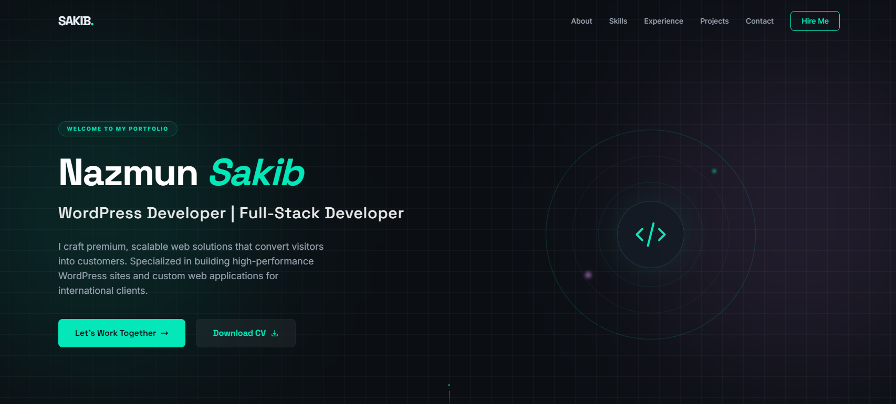

# DevFolio Pro

**DevFolio Pro** is a high-performance, premium developer portfolio template designed for software engineers and full-stack developers who want to showcase their technical authority with a sophisticated dark-themed aesthetic.

[](https://nextjs.org/)
[](https://tailwindcss.com/)
[](https://www.typescriptlang.org/)
[](LICENSE)

### 🔗 [Live Preview](https://nazmunsakib.com/)



## ✨ Features

- 🌑 **Premium Dark Aesthetic**: A curated dark-first design system using modern HSL colors.
- 🚀 **Built for Speed**: Next.js 15 App Router for optimized performance and SEO.
- 📱 **Fully Responsive**: Meticulously designed for Mobile, Tablet, and Desktop breakpoints.
- 🎨 **Component-Based**: Modular architecture with reusable UI building blocks (`Button`, `Card`).
- 🛠️ **Developer Friendly**: Structured data management in a single `portfolio.ts` file.
- ⚡ **Micro-Interactions**: Subtle hover glows, spinning geometric visuals, and smooth transitions.
- 🔍 **SEO Optimized**: Pre-configured metadata and semantic HTML5 structure.

## 🚀 Quick Start

### 1. Requirements
Ensure you have **Node.js 18.18+** installed on your machine.

### 2. Clone and Install
```bash
git clone https://github.com/nazmunsakib/devfolio-pro.git
cd devfolio-pro
npm install
```

### 3. Run Development Server
```bash
npm run dev
```
Open [http://localhost:3000](http://localhost:3000) to see your portfolio live.

## 🛠️ Customization Guide

### ⚙️ How to Change Your Data
This template is **fully data-driven**. You don't need to dig into the React components to change your text or project details.

1.  **Open the Data Store**: Navigate to `src/data/portfolio.ts`.
2.  **Edit the `portfolioData` Object**: 
    - **Personal Info**: Update `name`, `title`, and `summary`.
    - **Skills**: Add or remove items in the `skills` array. Use [Lucide Icon](https://lucide.dev/icons) names for the `icon` field.
    - **Experience**: Add your work history to the `experience` array. The UI will automatically handle the side-by-side alternating layout.
    - **Projects**: Update the `projects` array. Each project needs a name, description, tech stack (array of strings), and an image path.
3.  **Dynamic Rendering**: Once you save the file, Next.js will hot-reload, and the changes will reflect across all sections (Hero, Skills, Experience, Projects, Contact) immediately.

### 🎨 Branding & Colors
To change the primary/secondary theme colors, edit the CSS variables in:
`src/app/globals.css`

```css
:root {
  --primary: #04e8b9;   /* Your primary brand color */
  --secondary: #ec91ff; /* Your accent color */
}
```

## 🏗️ Folder Structure

```
├── src/
│   ├── app/           # App Router, layouts, and global styles
│   ├── components/    # Reusable sections and UI components
│   ├── data/          # Central Data Store (portfolio.ts)
│   └── lib/           # Utility functions
├── public/            # Static assets and icons
└── tailwind.config.ts # Tailwind CSS configuration
```

## 🚢 Deployment

### Deploy to Vercel (Recommended)
1. Fork this repository.
2. Connect your GitHub account to [Vercel](https://vercel.com/).
3. Create a "New Project" and select your `devfolio-pro` fork.
4. Click **Deploy**.

## 🤝 Contributing
Contributions are welcome! If you have suggestions for new components or improvements, feel free to open an issue or submit a pull request.

## 📄 License
Distributed under the **MIT License**. See `LICENSE` for more information.

---
Built with ❤️ by [Nazmun Sakib](https://github.com/nazmunsakib)
